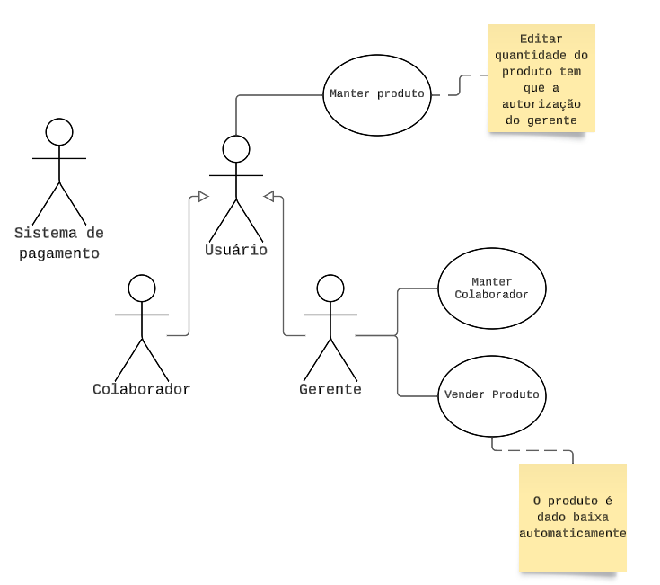

# Diagrama de Caso de Uso

[Link para o diagrama](https://lucid.app/lucidchart/22ee5153-410f-48be-9e4b-42a95e3f0678/edit?invitationId=inv_d4deb7ed-0afc-4be2-b5cc-7448a8a57ab8&page=0_0#)

# Documentação

## Manter Colaborador
**Nome:** Manter Colaborador  
**Descrição:** Este caso de uso permite que sejam cadastrados, editados e excluído os colabores pelos gerentes. As informações para os cadastros: `Nome, data de nascimento, cpf, e ramo do negócio`. _Autores_: Gerente 
**Pré-Condição:** Se a marca do ramo do negócio já existir na loja, será impossível cadastrar.  
**Pós-Condições:** NA

### Cenário Principal
***

**Inclusão:** 
> a. O gerente insere o nome, data de nascimento, cpf, e ramo do negócio do novo colaborador e clicar em salvar.
> b. O sistema salva as informações no sistema. 

**Remoção:** 
> a. O gerente informa o CPF do usuário e clica em remover do sistema.
> b. O sistema oculta as informações do colaborador.

**Consulta:**
> a. O gerente informa o CPF do colaborador e clica em buscar.
> b. O sistema retorna os dados do usuário.

**Edição:**
> a. O gerente informa o CPF do usuário e pode atualizar os dados do colaborador e clicar em salvar.
> b. O sistema salva as informações no sistema.

### Cenário Alternativo:

***
**Inclusão:**
> 1a. O ramo do negócio do colaborador já existe no sistema.
*  O sistema exibe que é impossível cadastrar mais de um colaborador com mesmo ramo de negócio e retorna ao sistema.

**Remoção, Consulta e Edição:**
> 2a. O gerente pode digitar o CPF incorreto ou o CPF pode não existir.
* O gerente digita novamente o CPF e clica em buscar.
* O sistema retorna os dados do colaborador se esse existir.
