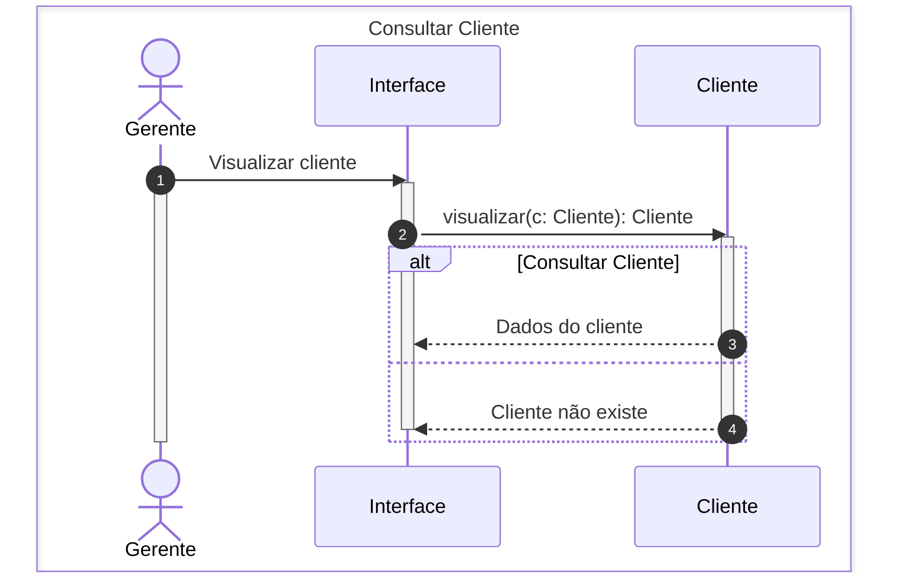
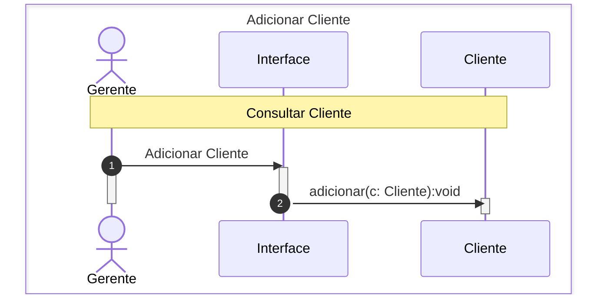
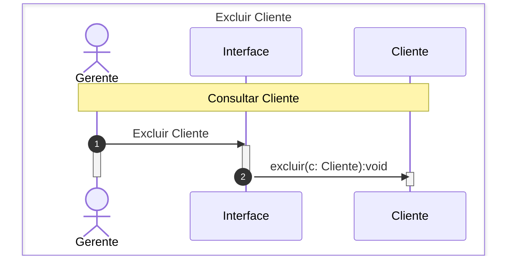

# Consultar

```mermaid
sequenceDiagram
    autonumber
    box Consultar Cliente
        actor Gerente
        participant Interface
        participant Cliente
    end

    Gerente->>Interface: Visualizar cliente
    activate Gerente
    activate Interface
    Interface->>Cliente: visualizar(c: Cliente): Cliente
    activate Cliente

    alt Consultar Cliente
        Cliente-->>Interface: Dados do cliente
    else
        Cliente-->>Interface: Cliente não existe
        deactivate Cliente
        deactivate Interface
    end

    deactivate Gerente

```
# Adicionar

```mermaid
sequenceDiagram
    autonumber
    box Adicionar Cliente
        actor Gerente
        participant Interface
        participant Cliente
    end

    note over Gerente, Cliente: Consultar Cliente

    Gerente->>Interface: Adicionar Cliente
    activate Gerente
    activate Interface
    Interface->>Cliente:adicionar(c: Cliente):void
    activate Cliente

    deactivate Cliente
    deactivate Interface
    deactivate Gerente
    
```
# Excluir

```mermaid
sequenceDiagram
    autonumber
    box Excluir Cliente
        actor Gerente
        participant Interface
        participant Cliente
    end

    note over Gerente, Cliente: Consultar Cliente
    
    Gerente->>Interface: Excluir Cliente
    activate Gerente
    activate Interface
    Interface->>Cliente:excluir(c: Cliente):void
    activate Cliente
    deactivate Cliente
    deactivate Interface
    deactivate Gerente
    
```
# Editar

```mermaid
sequenceDiagram
    autonumber
    box Editar Cliente
        actor Gerente
        participant Interface
        participant Cliente
    end

    note over Gerente, Cliente: Consultar Cliente

    Gerente->>Interface:Editar Cliente
    activate Gerente
    activate Interface
    Interface->>Cliente:editar(c: Cliente):void
    activate Cliente

    deactivate Cliente
    deactivate Interface
    deactivate Gerente
```