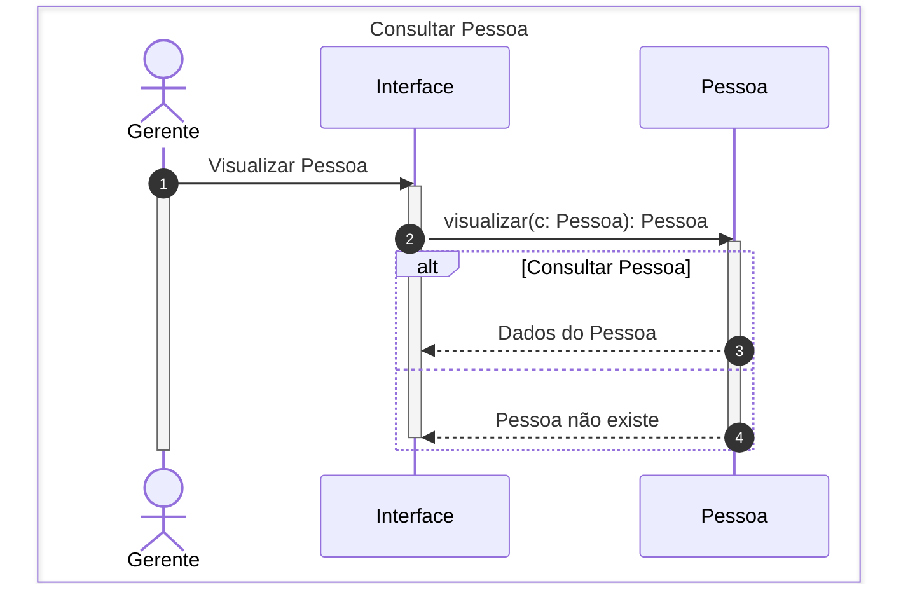
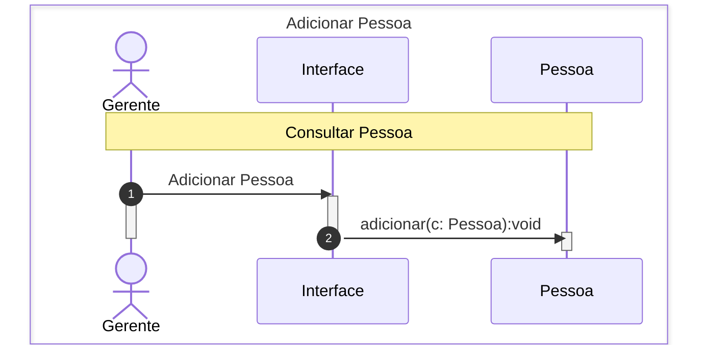
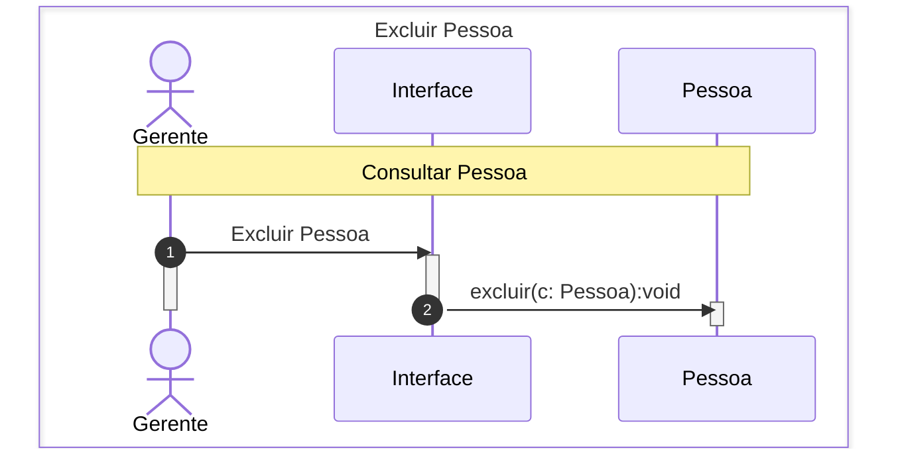
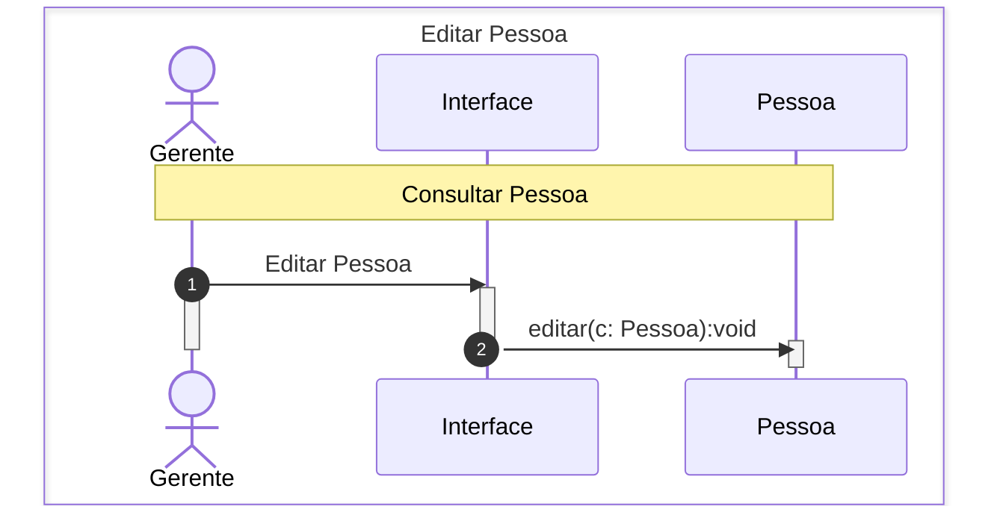

# Consultar

```mermaid
sequenceDiagram
    autonumber
    box Consultar Pessoa
        actor Gerente
        participant Interface
        participant Pessoa
    end

    Gerente->>Interface: Visualizar Pessoa
    activate Gerente
    activate Interface
    Interface->>Pessoa: visualizar(c: Pessoa): Pessoa
    activate Pessoa

    alt Consultar Pessoa
        Pessoa-->>Interface: Dados do Pessoa
    else
        Pessoa-->>Interface: Pessoa não existe
        deactivate Pessoa
        deactivate Interface
    end

    deactivate Gerente

```
# Adicionar

```mermaid
sequenceDiagram
    autonumber
    box Adicionar Pessoa
        actor Gerente
        participant Interface
        participant Pessoa
    end

    note over Gerente, Pessoa: Consultar Pessoa

    Gerente->>Interface: Adicionar Pessoa
    activate Gerente
    activate Interface
    Interface->>Pessoa:adicionar(c: Pessoa):void
    activate Pessoa

    deactivate Pessoa
    deactivate Interface
    deactivate Gerente
    
```
# Excluir

```mermaid
sequenceDiagram
    autonumber
    box Excluir Pessoa
        actor Gerente
        participant Interface
        participant Pessoa
    end

    note over Gerente, Pessoa: Consultar Pessoa
    
    Gerente->>Interface: Excluir Pessoa
    activate Gerente
    activate Interface
    Interface->>Pessoa:excluir(c: Pessoa):void
    activate Pessoa
    deactivate Pessoa
    deactivate Interface
    deactivate Gerente
    
```
# Editar

```mermaid
sequenceDiagram
    autonumber
    box Editar Pessoa
        actor Gerente
        participant Interface
        participant Pessoa
    end

    note over Gerente, Pessoa: Consultar Pessoa

    Gerente->>Interface:Editar Pessoa
    activate Gerente
    activate Interface
    Interface->>Pessoa:editar(c: Pessoa):void
    activate Pessoa

    deactivate Pessoa
    deactivate Interface
    deactivate Gerente
```