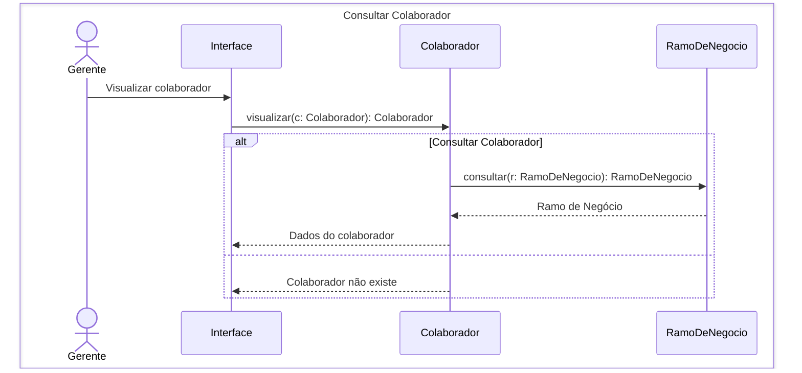
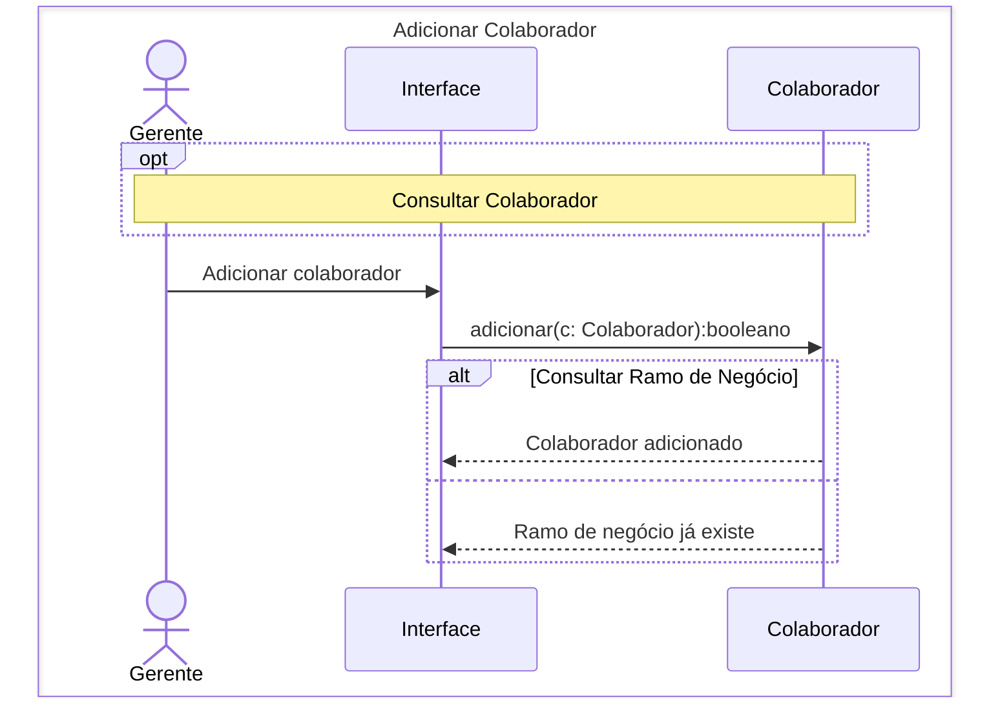
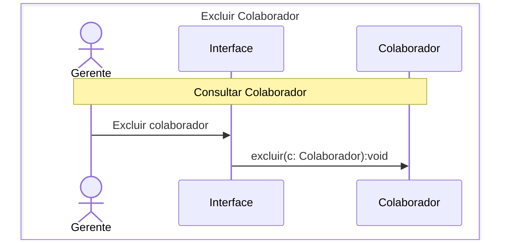
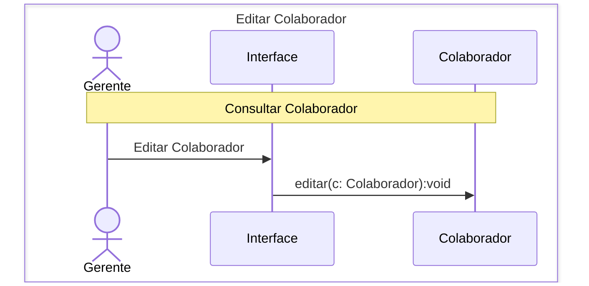

```mermaid
%%{init: {'theme': 'default'}}%%
sequenceDiagram
    box Consultar Colaborador
        actor Al as Gerente
        participant Interface
        participant Colaborador
        participant RamoDeNegocio
    end

    Al->>Interface: Visualizar colaborador
    Interface->>Colaborador: visualizar(c: Colaborador): Colaborador

    alt Consultar Colaborador
        Colaborador->>RamoDeNegocio: consultar(r: RamoDeNegocio): RamoDeNegocio
        RamoDeNegocio-->>Colaborador: Ramo de Negócio
        Colaborador-->>Interface: Dados do colaborador
    else
        Colaborador-->>Interface: Colaborador não existe
    end


```

```mermaid
%%{init: {'theme': 'default'}}%%
sequenceDiagram
    box Adicionar Colaborador
        actor Al as Gerente
        participant Interface
        participant Colaborador
    end

    opt
        note over Al, Colaborador: Consultar Colaborador
    end

    Al->>Interface: Adicionar colaborador
    Interface->>Colaborador:adicionar(c: Colaborador):booleano

    alt Consultar Ramo de Negócio
        Colaborador-->>Interface: Colaborador adicionado
    else
        Colaborador-->>Interface: Ramo de negócio já existe
    end
    
```

```mermaid
%%{init: {'theme': 'default'}}%%
sequenceDiagram
    box Excluir Colaborador
        actor Al as Gerente
        participant Interface
        participant Colaborador
    end

    
    note over Al, Colaborador: Consultar Colaborador
    

    Al->>Interface: Excluir colaborador
    Interface->>Colaborador:excluir(c: Colaborador):void
```

```mermaid
%%{init: {'theme': 'default'}}%%
sequenceDiagram
    box Editar Colaborador
        Actor Al as Gerente
        participant Interface
        participant Colaborador
    end

    note over Al, Colaborador: Consultar Colaborador

    Al->>Interface:Editar Colaborador
    Interface->>Colaborador:editar(c: Colaborador):void

```