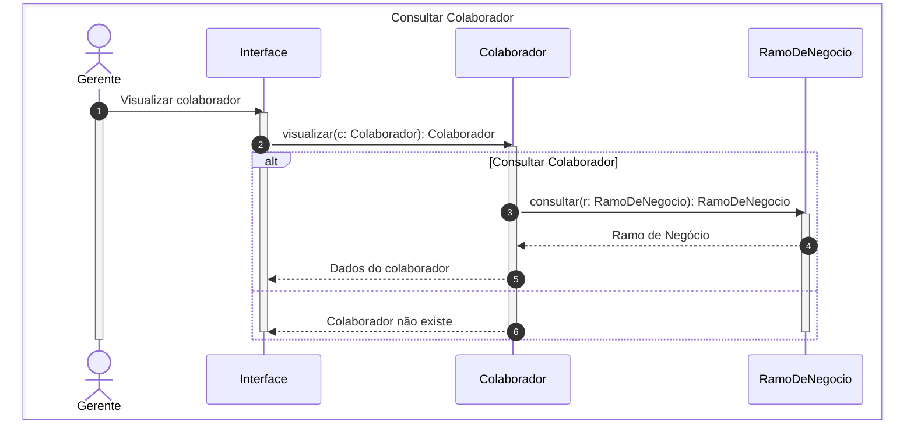
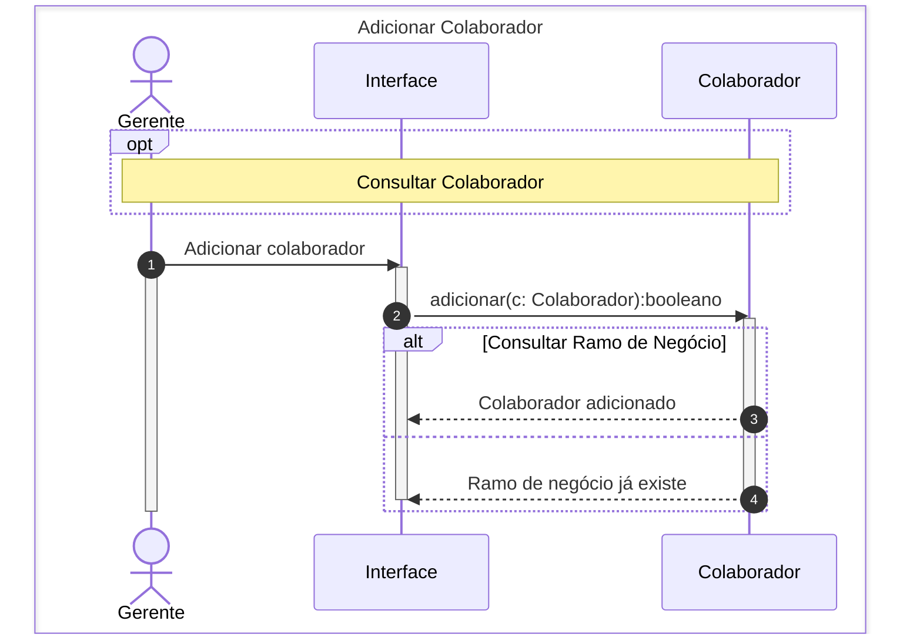
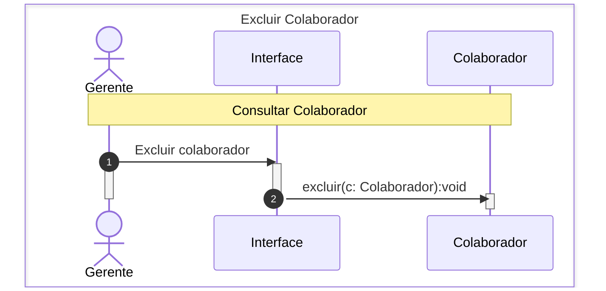
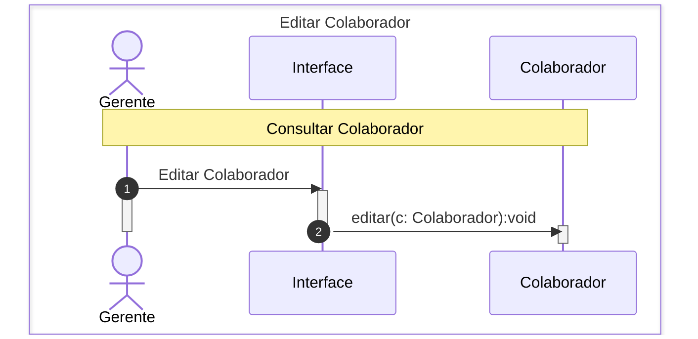

# Consultar

```mermaid
sequenceDiagram
    autonumber
    box Consultar Colaborador
        actor Gerente
        participant Interface
        participant Colaborador
        participant RamoDeNegocio
    end

    Gerente->>Interface: Visualizar colaborador
    activate Gerente
    activate Interface
    Interface->>Colaborador: visualizar(c: Colaborador): Colaborador
    activate Colaborador

    alt Consultar Colaborador
        Colaborador->>RamoDeNegocio: consultar(r: RamoDeNegocio): RamoDeNegocio
        activate RamoDeNegocio
        RamoDeNegocio-->>Colaborador: Ramo de Negócio
        Colaborador-->>Interface: Dados do colaborador
    else
        Colaborador-->>Interface: Colaborador não existe
        deactivate RamoDeNegocio
        deactivate Colaborador
        deactivate Interface
    end
    deactivate Gerente

```
# Adicionar

```mermaid
sequenceDiagram
    autonumber
    box Adicionar Colaborador
        actor Gerente
        participant Interface
        participant Colaborador
    end

    opt
        note over Gerente, Colaborador: Consultar Colaborador
    end

    Gerente->>Interface: Adicionar colaborador
    activate Gerente
    activate Interface
    Interface->>Colaborador:adicionar(c: Colaborador):booleano
    activate Colaborador

    alt Consultar Ramo de Negócio
        Colaborador-->>Interface: Colaborador adicionado
    else
        Colaborador-->>Interface: Ramo de negócio já existe
        deactivate Colaborador
        deactivate Interface
    end
    deactivate Gerente
    
```
# Excluir

```mermaid
sequenceDiagram
    autonumber
    box Excluir Colaborador
        actor Gerente
        participant Interface
        participant Colaborador
    end

    note over Gerente, Colaborador: Consultar Colaborador
    
    Gerente->>Interface: Excluir colaborador
    activate Gerente
    activate Interface
    Interface->>Colaborador:excluir(c: Colaborador):void
    activate Colaborador
    deactivate Colaborador
    deactivate Interface
    deactivate Gerente
    
```
# Editar

```mermaid
sequenceDiagram
    autonumber
    box Editar Colaborador
        actor Gerente
        participant Interface
        participant Colaborador
    end

    note over Gerente, Colaborador: Consultar Colaborador

    Gerente->>Interface:Editar Colaborador
    activate Gerente
    activate Interface
    Interface->>Colaborador:editar(c: Colaborador):void
    activate Colaborador

    deactivate Colaborador
    deactivate Interface
    deactivate Gerente
```