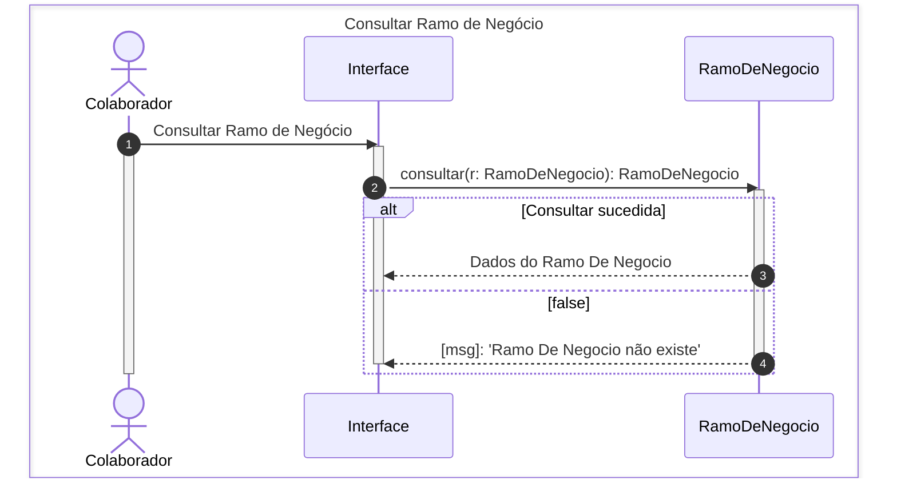
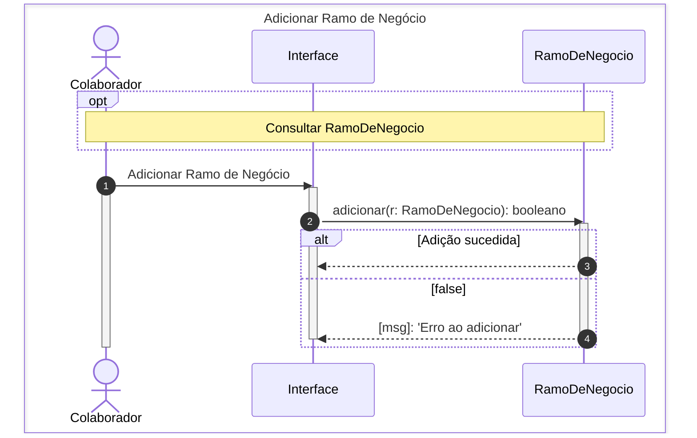
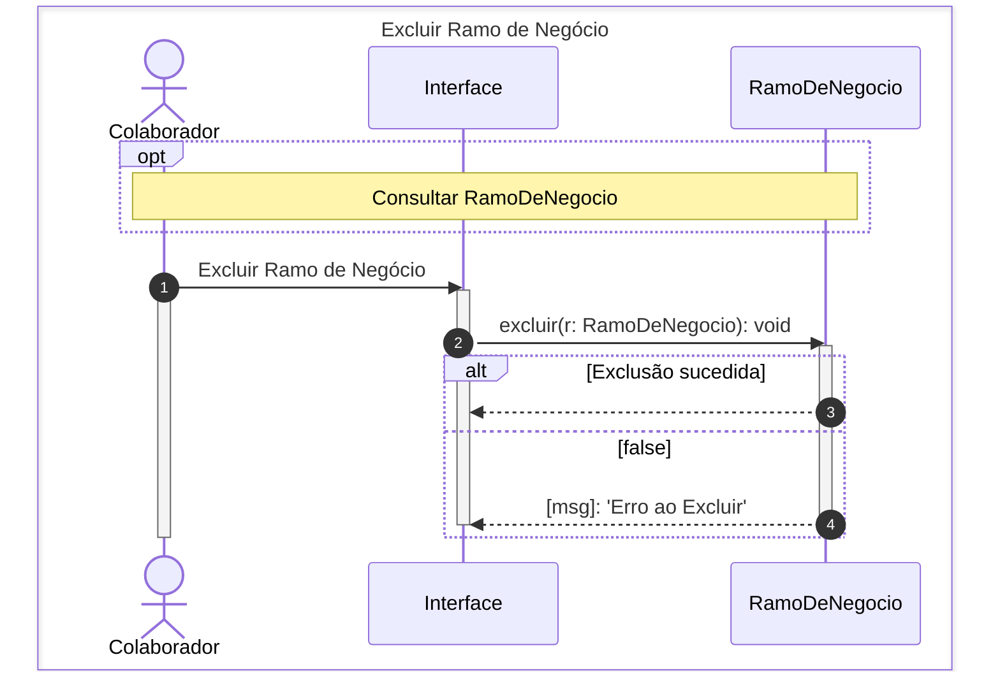
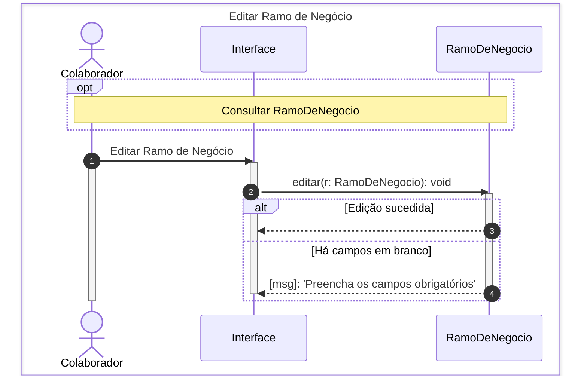

# Consultar 

```mermaid
sequenceDiagram
    autonumber
    box Consultar Ramo de Negócio
        actor Colaborador
        participant Interface
        participant RamoDeNegocio
    end

    Colaborador->>Interface: Consultar Ramo de Negócio
    activate Colaborador
    activate Interface
    Interface->>RamoDeNegocio: consultar(r: RamoDeNegocio): RamoDeNegocio
    activate RamoDeNegocio

    alt Consultar sucedida
        RamoDeNegocio-->>Interface: Dados do Ramo De Negocio
    else false
        RamoDeNegocio-->>Interface: [msg]: 'Ramo De Negocio não existe'
        deactivate RamoDeNegocio
        deactivate Interface
    end
    deactivate Colaborador
```
# Adicionar

```mermaid
sequenceDiagram
    autonumber
    box Adicionar Ramo de Negócio
        actor Colaborador
        participant Interface
        participant RamoDeNegocio
    end

    opt
        note over Colaborador, RamoDeNegocio: Consultar RamoDeNegocio
    end

    Colaborador->>Interface: Adicionar Ramo de Negócio
    activate Colaborador
    activate Interface
    Interface->>RamoDeNegocio: adicionar(r: RamoDeNegocio): booleano
    activate RamoDeNegocio

    alt Adição sucedida
        RamoDeNegocio-->>Interface: 
    else false
        RamoDeNegocio-->>Interface: [msg]: 'Erro ao adicionar'
        deactivate RamoDeNegocio
        deactivate Interface
    end
    deactivate Colaborador
```
# Excluir

```mermaid
sequenceDiagram
    autonumber
    box Excluir Ramo de Negócio
        actor Colaborador
        participant Interface
        participant RamoDeNegocio
    end

    opt
        note over Colaborador, RamoDeNegocio: Consultar RamoDeNegocio
    end
    
    Colaborador->>Interface: Excluir Ramo de Negócio
    activate Colaborador
    activate Interface
    Interface->>RamoDeNegocio: excluir(r: RamoDeNegocio): void
    activate RamoDeNegocio


    alt Exclusão sucedida
        RamoDeNegocio-->>Interface: 
    else false
        RamoDeNegocio-->>Interface: [msg]: 'Erro ao Excluir'
        deactivate RamoDeNegocio
        deactivate Interface
    end
    deactivate Colaborador
```
# Editar

```mermaid
sequenceDiagram
    autonumber
    box Editar Ramo de Negócio
        actor Colaborador
        participant Interface
        participant RamoDeNegocio
    end

    opt
        note over Colaborador, RamoDeNegocio: Consultar RamoDeNegocio
    end

    Colaborador->>Interface: Editar Ramo de Negócio
    activate Colaborador
    activate Interface
    Interface->>RamoDeNegocio: editar(r: RamoDeNegocio): void
    activate RamoDeNegocio


    alt Edição sucedida
        RamoDeNegocio-->>Interface: 
    else Há campos em branco
        RamoDeNegocio-->>Interface: [msg]: 'Preencha os campos obrigatórios' 
        deactivate RamoDeNegocio
        deactivate Interface
    end
    deactivate Colaborador
```
