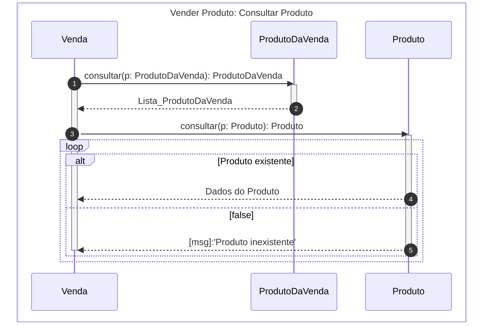
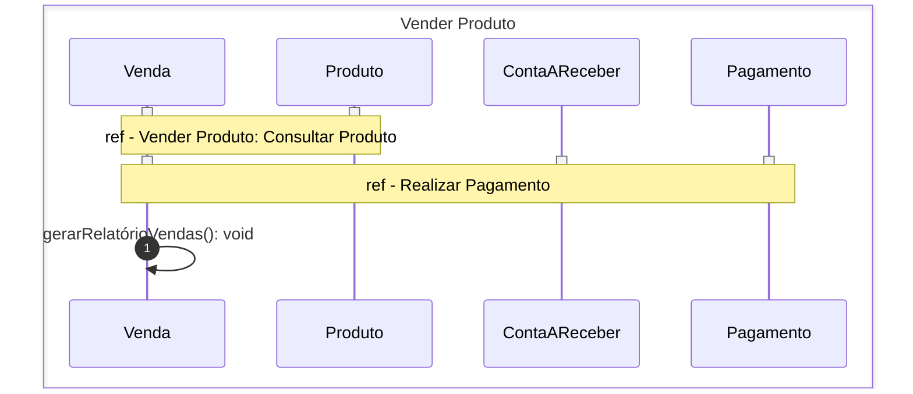

# Vender Produto
## Vender Produto: Consultar Produto

```mermaid
sequenceDiagram
    autonumber
    box Vender Produto: Consultar Produto
        participant Venda
        participant ProdutoDaVenda
        participant Produto
    end

    Venda->>ProdutoDaVenda: consultar(p: ProdutoDaVenda): ProdutoDaVenda
    activate Venda
    activate ProdutoDaVenda

    ProdutoDaVenda-->>Venda: Lista_ProdutoDaVenda
    deactivate ProdutoDaVenda

    Venda->>Produto: consultar(p: Produto): Produto
    activate Produto

    loop
        alt Produto existente
            Produto-->>Venda: Dados do Produto
        else false
            Produto-->>Venda: [msg]:'Produto inexistente'
            deactivate Produto
            deactivate Venda
        end
    end
```
## Vender Produto

```mermaid
sequenceDiagram
    autonumber
    box Vender Produto
        participant Venda
        participant Produto
        participant ContaAReceber
        participant Pagamento
    end

    activate Venda
    activate Produto
    Note over Venda, Produto: ref - Vender Produto: Consultar Produto
    deactivate Venda
    deactivate Produto

    activate Venda
    activate ContaAReceber
    activate Pagamento
    Note over Venda, Pagamento: ref - Realizar Pagamento
    deactivate Venda
    deactivate ContaAReceber
    deactivate Pagamento

    Venda->>Venda: gerarRelatórioVendas(): void
```
