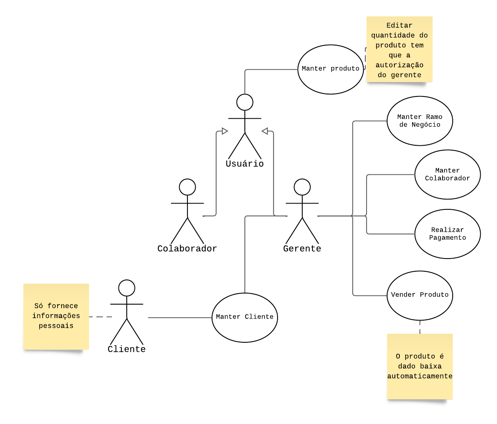

# Documentação - COLAB

## Descrição do Projeto

### Definição dos usuários

| Número | Perfil | Descrição |
| ---------- | ------- | ------|
| 1 | Colaborador | Usuário do sistema o qual tem função de colabor na loja, ele pode adicionar, solicitar a baixa e alterar produtos. Ele pode visualizar apenas seus próprios produtos dentro do sistema. |
| 2 | Gerente | Usuário do sistema o qual gerencia os colabores, possui a visão geral dos colabores, como estoque, vendas e pagamentos de aluguel.|
| 3 | Sistema de Pagamento | Sistema externo de pagamento |

### Requisitos Funcionais
| Requisito | Descrição | Ator |
| - | - | - |
| RF01 | Adicionar os produtos dentro do sistema com suas informações [COD, NOME, PREÇO, DESCRIÇÃO] | Colaborador |
| RF02 | Solicitar a baixa, em quantidade, de algum produto em específico | Colaborador |
| RF03 | Visualizar vendas e produtos da sua loja | Colaborador |
| RF04 | Alterar informações do produto | Colabodrador |
| RF05 | Visualizar relatórios de vendas | Colaborador |
| RF06 | Cadastrar o usuário com todas suas informações pessoais e seu ramo de venda [DADOS PESSOAIS, RAMO DO NEGÓCIO] | Gerente |
| RF07 | Notificar sobre a falta de estoque aos colaboradore| Gerente |
| RF08 | Visualizar todos os colabores da loja | Gerente |
| RF09 | Visualizar o estoque dos colaboradores | Gerente |
| RF10 | Visualizar todas as vendas do sistema | Gerente |

### Requisitos Não Funcionais
| Requisito | Descrição |
| - | - |
| RNF01 | Impedir que dois colabores vendão o mesmo produto |
| RNF02 | Impedir que tenha mais de dois ramo iguais na mesma loja |
| RNF03 | O sistema deve fazer o backup das informações pelo menos uma vez ao dia |
| RNF04 | O sistema deve ser web |
| RNF05 | As credenciais dos colabores e informações pessoais sensíveis devem ser criptografadas |
| RNF06 | A UI deve ser de fácil acesso aos usuários que são leigos em informática|
| RNF07 | A UI deve possuir cores que cumpram os requisitos determinandos pelos padrões WCAG em exigências com **POUR** |
| RNF08 | O sistema deve ser escalável com o tempo |

# Diagrama de Caso de Uso

[Link para o diagrama](https://lucid.app/lucidchart/22ee5153-410f-48be-9e4b-42a95e3f0678/edit?invitationId=inv_d4deb7ed-0afc-4be2-b5cc-7448a8a57ab8&page=0_0#)

# Documentação

## Manter Colaborador
**Nome:** Manter Colaborador  
**Descrição:** Este caso de uso permite que sejam cadastrados, editados e excluído os colabores pelos gerentes. As informações para os cadastros: `Nome, data de nascimento, cpf, e ramo do negócio`. _Autores_: Gerente 
**Pré-Condição:** Se a marca do ramo do negócio já existir na loja, será impossível cadastrar.  
**Pós-Condições:** Um ID único foi gerado e associado ao colaborador.

### Cenário Principal
***

**Inclusão:** 
> 1. O gerente preenche os dados do colaborador e clica em "Salvar". 
> 2. O sistema armazena as informações no banco de dados e confirma a inclusão.

**Consulta:**
> 1. O gerente informa o CPF do colaborador e clica em "buscar". 
> 2. O sistema exibe os dados do colaborador.

**Edição:**
> 1. O gerente informa o CPF do colaborador (include consulta). 
> 2. O gerente atualiza os dados desejados e clica em “Atualizar”. 
> 3. O sistema salva as novas informações no banco de dados.

**Remoção:** 
> 1. O gerente informa o CPF do colaborador (include Consulta). 
> 2. O gerente clica em “Remover”. 
> 2. O sistema oculta as informações pessoais do colaborador e marca o status como inativo.

### Cenário Alternativo:
***

**Inclusão:**
> 2a. O ramo do negócio do colaborador já existe no sistema.
  - 1. O sistema exibe que é impossível cadastrar mais de um colaborador com mesmo ramo de negócio e retorna ao sistema.

**Remoção, Consulta e Edição:**
> 2a. O CPF informado é inválido.
  - 1. O sistema informará que o CPF é inválido.
  - 2. O gerente digita um novo CPF válido e clica em "Salvar".
  - 3. O sistema salva os dados do cliente no banco de dados.

## Manter Cliente
**Nome:** Manter Cliente  
**Descrição:** Este caso de uso permite que sejam cadastrados, editados e excluidos os clientes pelos gerentes. As informações para os cadastros: `Nome, cpf, endereço e contato`.  
_Autores_: Gerente 
**Pré-Condição:** O Cliente ainda não está cadastrado no sistema. 
**Pós-Condição:** Um ID único foi gerado e associado ao cliente.

### Cenário Principal
***

**Inclusão:**
> 1. O gerente preenche os dados do cliente clica em “Salvar”.  
> 2. O sistema armazena as informações no banco de dados e confirma a inclusão.

**Consulta:**
> 1. O gerente informa o CPF do cliente e clica em “Buscar”. 
> 2. O sistema exibe os dados do cliente.

**Edição:**
> 1. O gerente informa o CPF do cliente (include consulta). 
> 2. O gerente atualiza os dados desejados e clica em “Atualizar”. 
> 3. O sistema salva as novas informações no banco de dados.

**Remoção:**
> 1. O gerente informa o CPF do cliente (include consulta). 
> 2. O gerente clica em “Remover”. 
> 3. O sistema oculta as informações pessoais do cliente e marca o status como inativo.

### Cenário Alternativo:
***

**Inclusão ou Edição:**
> 2a. O CPF informado é inválido.
  - 1. O sistema informará que o CPF é inválido.
  - 2. O gerente digita um novo CPF válido e clica em "Salvar".
  - 3. O sistema salva os dados do cliente no banco de dados.

**Consulta ou Remoção:**
> 2a. O cliente não está cadastrado no sistema.
  - 1. O sistema exibe uma mensagem de cliente não cadastrado.

## Manter Produto
**Nome:** Manter Produto 
**Descrição:** Este caso de uso permite que sejam cadastrados, consultados, editados e removidos os produtos. As informações para cadastro: `Nome, Descrição, Quantidade e Valor Unitário`. 
_Autores_: Colaborador e Gerente. 
**Pré-Condição:** NA 
**Pós-Condição:** Um ID único foi gerado e associado a um produto.

### Cenário Principal:
***

**Inclusão:**
> 1. O colaborador preenche os dados do produto e clica em "Salvar". 
> 2. O sistema armazena as informações no banco de dados e confirma a inclusão. 

**Consulta:**
> 1. O sistema exibe uma prévia de todos os produtos do colaborador. 
> 2. O colaborador ou gerente informa o ID do produto que quer fazer a consulta detalhada e clica em "Buscar". 
> 3. O sistema exibe todos os dados do produto.

**Edição:**
> 1. O colaborador informa o ID do produto (include consulta). 
> 2. O colaborador atualiza os dados desejados e clica em "Atualizar". 
> 3. O sistema salva as novas informações no banco de dados.

**Remoção:**
> 1. O colaborador informa o ID do produto (include consulta). 
> 2. O colaborador clica em "Remover". 
> 3. O sistem oculta as informações do produto e marca o status como inativo.

### Cenário Alternativo:
***

**Inclusão:**
> 2a. já existe um produto com o mesmo nome associado ao colaborador.
  - 1. O sistema informará que já existe um produto com o mesmo nome.
  - 2. O colaborador escolhe:
       - a. Digitar um novo nome para o produto.
       - b. Cancelar a operação e voltar para a página principal.
  - 3. Se o colaborador informar um novo nome para o produto, o sistema salva os dados do produto no banco de dados.

**Consulta, Edição e Remoção:**
> 2a. O produto não cadastrado no sistema.
  - 1. O sistema exibe uma mensagem de produto não cadastrado.

## Manter Ramo de Negócio
**Nome:** Manter Ramo de Negócio. 
**Descrição:** Este caso de uso permite que sejam cadastrados, consultados, editados e removidos os ramos de negócios dos colaboradores. As informações para cadastro: `Nome`. 
_Autores_: Gerente. 
**Pré-Condição:** NA 
**Pós-Condição:** Um ID único foi gerado e associado a um ramo de negócio.

### Cenário Principal:
***

**Inclusão:**
> 1. O gerente preenche os dados do ramo de negócio e clica em "Salvar". 
> 2. O sistema armazena as informações no banco de dados e confirma a inclusão. 

**Consulta:**
> 1. O sistema exibe uma prévia de todos os ramos de negócios já cadastrados. 
> 2. O gerente informa o ID do ramo de negócio que quer fazer a consulta detalhada e clica em "Buscar". 
> 3. O sistema exibe todos os dados do ramo de negócio.

**Edição:** 
> 1. O gerente informa o ID do ramo de negócio (include consulta). 
> 2. O gerente atualiza os dados desejados e clica em "Atualizar". 
> 3. O sistema salva as novas informações no banco de dados.

**Remoção:**
> 1. O gerente informa o ID do ramo de negócio (include consulta). 
> 2. O gerente clica em "Remover". 
> 3. O sistem oculta as informações do ramo de negócio e marca o status como inativo.

### Cenário Alternativo:
***

**Inclusão:**
> 2a. já existe um ramo de negócio com o mesmo nome no sistema.
  - 1. O sistema informará que já existe um produto com o mesmo nome.
  - 2. O gerente escolhe:
       - a. Digitar um novo nome para o ramo de negócio.
       - b. Cancelar a operação e voltar para a página principal.
  - 3. Se o gerente informar um novo nome para o ramo de negócio, o sistema salva os dados do ramo de negócio no banco de dados.

**Consulta, Edição e Remoção:**
> 2a. O ramo de negócio não cadastrado no sistema.
  - 1. O sistema exibe uma mensagem de ramo de negócio não cadastrado.

## Vender Produto
**Nome:** Vender Produto. 
**Descrição:** Este caso de uso permite que seja realizada uma venda pelo gerente. 
_Autores_: Gerente. 
**Pré-Condição:** NA 
**Pós-Condição:** Venda registrada; estoque atualizado e um ID único gerado e associado a venda

### Cenário Principal:
***

**Seleção de Produtos:**
> 1. O gerente informa os IDs dos produtos. 
> 2. O gerente informa a quantidade de produtos. 
> 3. O sistema calcula o total da venda. 
> 4. A venda é confirmada e enviada para o pagamento. 
> 5. O sistema da baixa no estoque.

## Cenário Alternativo:
***

**Seleção de Produtos:**
> 1a. O ID informado é inválido: 
  - 1. O sistema informa que o ID é inválido. 
  - 2. O gerente escolhe: 
       - Informa um novo ID. 
       - Cancelar a seleção do produto e voltar para a página principal. 
  - 3. Se o gerente informar um novo ID, o sistema volta para o fluxo principal. 
> 2a. Quantidade de produtos insuficiente. 
  - 1. O sistema informa que a quantidade está insuficiente. 

## Realizar Pagamento
**Nome:** Realizar Pagamento. 
**Descrição:** Este caso de uso permite que seja realizado um pagamento. 
_Autores_: Gerente. 
**Pré-Condição:** Venda registrada e valor total definido 
**Pós-Condição:** Pagamento registrado e ID único gerado e associado ao pagamento.

### Cenário Principal:
***

**Realizar Pagamento:**
> 1. Sistema apresenta total a pagar. 
> 2. Funcionário escolhe forma de pagamento. 
> 3. Cliente paga. 
> 4. Sistema confirma pagamento. 
> 5. Finaliza venda.

### Cenário Alternativo:
***

**Realizar Pagamento:**
> 3a. O cliente desiste. 
  - 1. O gerente cancela a venda. 
