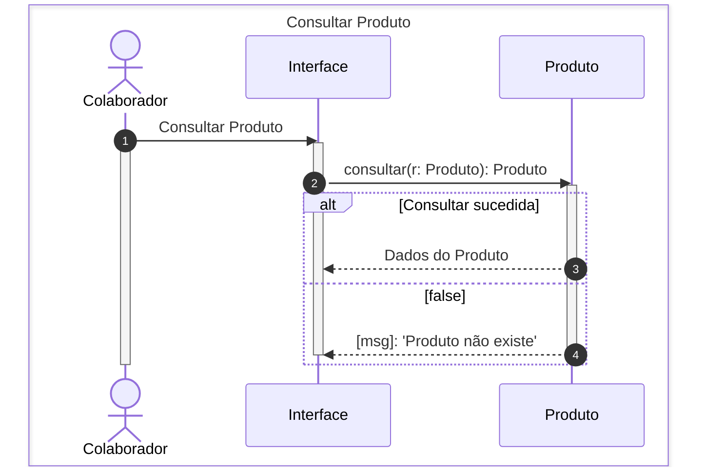
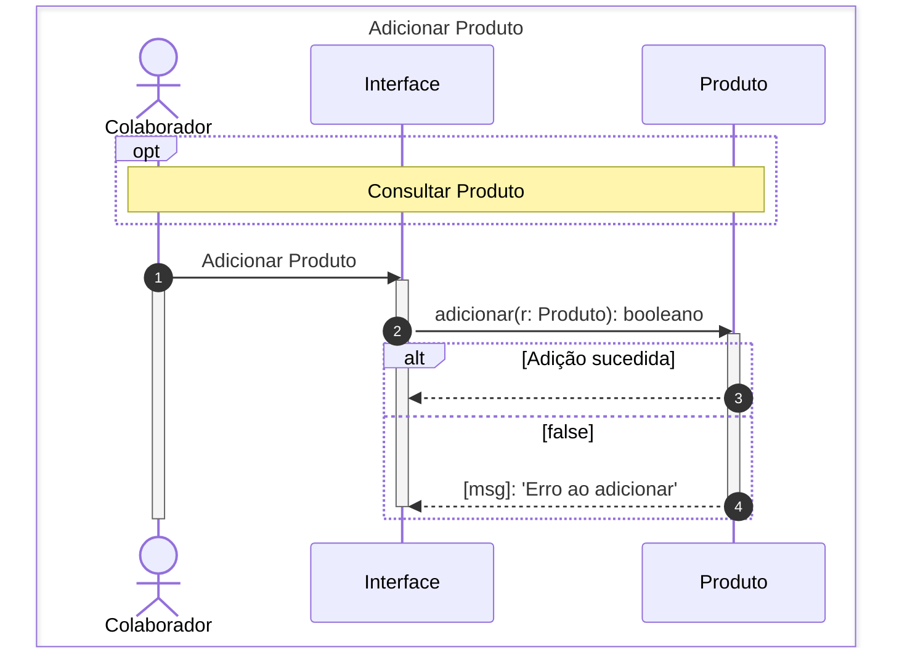
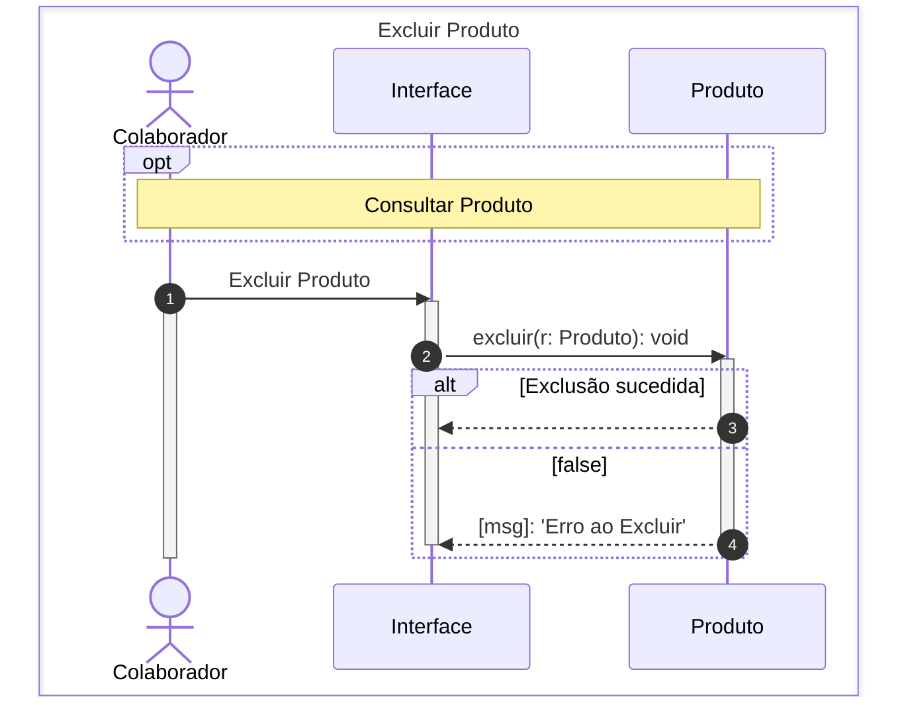
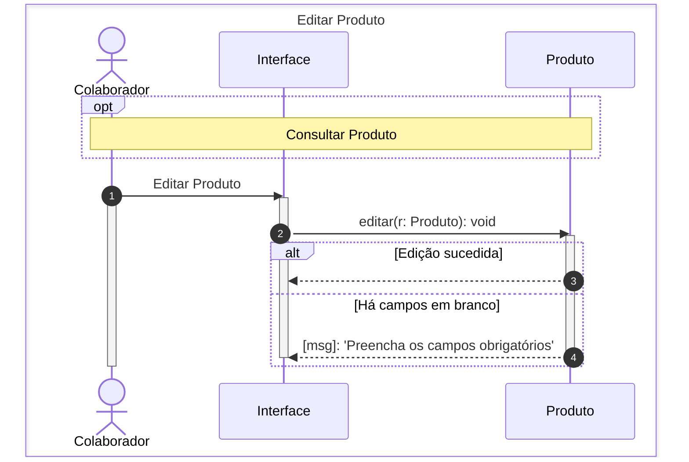

# Consultar 

```mermaid
sequenceDiagram
    autonumber
    box Consultar Produto
        actor Colaborador
        participant Interface
        participant Produto
    end

    Colaborador->>Interface: Consultar Produto
    activate Colaborador
    activate Interface
    Interface->>Produto: consultar(r: Produto): Produto
    activate Produto

    alt Consultar sucedida
        Produto-->>Interface: Dados do Produto
    else false
        Produto-->>Interface: [msg]: 'Produto não existe'
        deactivate Produto
        deactivate Interface
    end
    deactivate Colaborador
```
# Adicionar

```mermaid
sequenceDiagram
    autonumber
    box Adicionar Produto
        actor Colaborador
        participant Interface
        participant Produto
    end

    opt
        note over Colaborador, Produto: Consultar Produto
    end

    Colaborador->>Interface: Adicionar Produto
    activate Colaborador
    activate Interface
    Interface->>Produto: adicionar(r: Produto): booleano
    activate Produto

    alt Adição sucedida
        Produto-->>Interface: 
    else false
        Produto-->>Interface: [msg]: 'Erro ao adicionar'
        deactivate Produto
        deactivate Interface
    end
    deactivate Colaborador
```
# Excluir

```mermaid
sequenceDiagram
    autonumber
    box Excluir Produto
        actor Colaborador
        participant Interface
        participant Produto
    end

    opt
        note over Colaborador, Produto: Consultar Produto
    end
    
    Colaborador->>Interface: Excluir Produto
    activate Colaborador
    activate Interface
    Interface->>Produto: excluir(r: Produto): void
    activate Produto

    alt Exclusão sucedida
        Produto-->>Interface: 
    else false
        Produto-->>Interface: [msg]: 'Erro ao Excluir'
        deactivate Produto
        deactivate Interface
    end
    deactivate Colaborador
```
# Editar

```mermaid
sequenceDiagram
    autonumber
    box Editar Produto
        actor Colaborador
        participant Interface
        participant Produto
    end

    opt
        note over Colaborador, Produto: Consultar Produto
    end

    Colaborador->>Interface: Editar Produto
    activate Colaborador
    activate Interface
    Interface->>Produto: editar(r: Produto): void
    activate Produto

    alt Edição sucedida
        Produto-->>Interface: 
    else Há campos em branco
        Produto-->>Interface: [msg]: 'Preencha os campos obrigatórios' 
        deactivate Produto
        deactivate Interface
    end
    deactivate Colaborador
```
