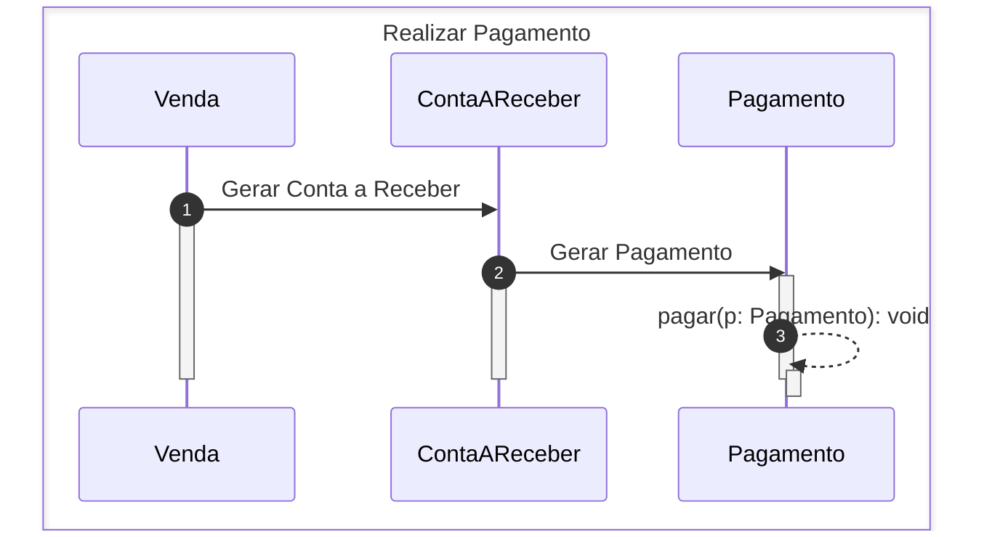

# Realizar Pagamento

```mermaid
sequenceDiagram
    autonumber
    box Realizar Pagamento
        participant Venda
        participant ContaAReceber
        participant Pagamento
    end

    Venda->>ContaAReceber: Gerar Conta a Receber
    activate Venda
    ContaAReceber->>Pagamento: Gerar Pagamento
    activate ContaAReceber
    activate Pagamento

    Pagamento-->>Pagamento: pagar(p: Pagamento): void
    activate Pagamento
    deactivate Pagamento
    deactivate Venda
    deactivate ContaAReceber
    deactivate Pagamento
```
